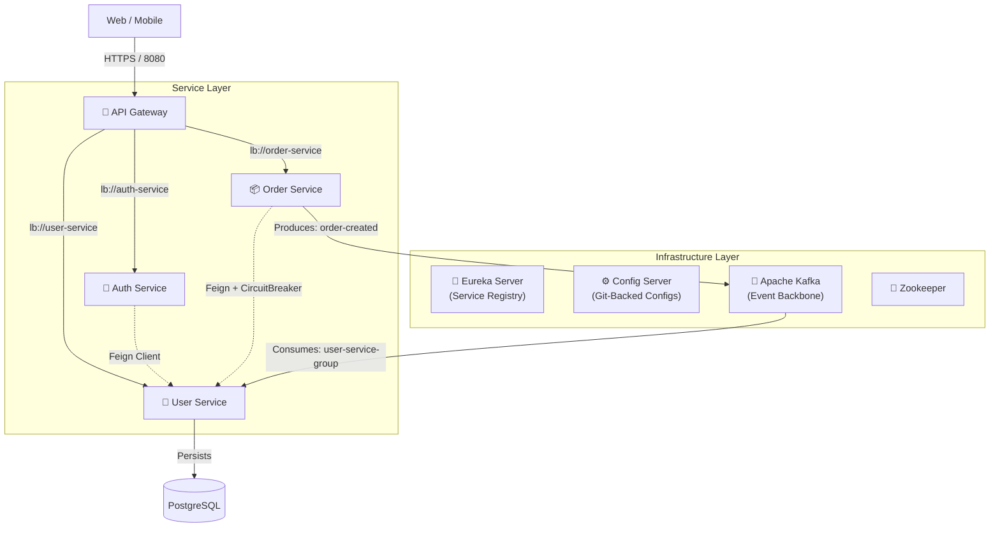
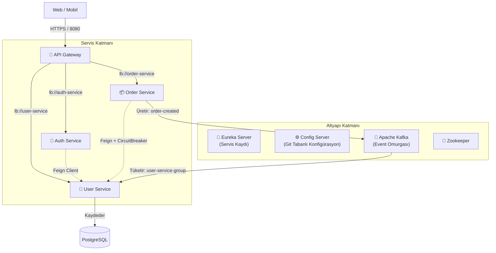

# 🚀 Microservices Event-Driven E-Commerce Architecture


This project demonstrates **senior-level architectural patterns** utilizing **Spring Cloud 2025** ecosystem. It features a fully decoupled Event-Driven Architecture (EDA) where services communicate asynchronously via **Apache Kafka** and synchronously via **OpenFeign** (with Resilience4j applied on critical synchronous paths).

---

## 🧠 Architectural Overview

The system is designed with **domain-driven separation** in mind. A unique architectural choice here is the **Delegated Auth Pattern**: The `auth-service` handles security processing (JWT/BCrypt) but delegates user data persistence and retrieval to the `user-service` via a Feign Client, ensuring a Single Source of Truth (SSOT).

### 🏗️ Live Architecture Graph



---

## 🛠️ Tech Stack & Versioning (Verified)

| Component | Technology | Version / Detail |
| :--- | :--- | :--- |
| **Language** | Java | **17 (LTS)** |
| **Framework** | Spring Boot | **3.5.x** |
| **Cloud** | Spring Cloud | **2025.0.1** |
| **Messaging** | Apache Kafka | **Confluent 7.6.0** |
| **DB** | PostgreSQL | `docker:latest` |
| **Resilience** | Resilience4j | **Circuit Breaker** |
| **Security** | Spring Security | **Stateless Auth (JWT-ready), BCrypt** |
| **Container** | Docker Compose | V2 |

---

## 🧱 Microservices In-Depth Analysis

### 1️⃣ Config Server `(config-server)`
*   **Port**: `8888`
*   **Strategy**: Local Git Repository (`/config-repo`)
*   **Serving**: 
    *   `api-gateway.yaml`: Defines Gateway routes and JWT secret placeholder.
    *   `order-service.yaml`: Configures **Resilience4j** thresholds (50% failure rate).
    *   `user-service.yml`: Postgres connection and Kafka consumer props.

### 2️⃣ API Gateway `(api-gateway)`
*   **Port**: `8080` (Exposed)
*   **Type**: Reactive (Spring WebFlux)
*   **Routes Configured**:
    *   `Path=/auth/**` ➡️ `auth-service`
    *   `Path=/users/**` ➡️ `user-service`
    *   `Path=/orders/**` ➡️ `order-service`

### 3️⃣ Auth Service `(auth-service)`
*   **Port**: Ephemeral (Random `0`)
*   **Security Context**:
    *   **Stateless** Session Policy
    *   **BCrypt** Password Encoder
    *   **Endpoints**: `/auth/login`, `/auth/register` (PermitAll)
*   **Integration**: Uses `UserClient` to communicate with `user-service`.

### 4️⃣ Order Service `(order-service)`
*   **Port**: Ephemeral
*   **Resilience**: Implements `UserClientFallback` for fault tolerance when `user-service` is down.
*   **Event Producer**:
    *   **Topic**: `order-created`
    *   **Payload Class**: `OrderCreatedEvent.java`
    *   **Trigger**: Successful order placement.

### 5️⃣ User Service `(user-service)`
*   **Port**: Ephemeral
*   **Persistence**: PostgreSQL (`userdb`)
*   **Event Consumer**:
    *   **Listener**: `OrderCreatedConsumer.java`
    *   **Group ID**: `user-service-group`
    *   **Mechanism**: Logs event receipt (`System.out.println("🔥 Order event consumed!")`)

---

## 📨 Event Driven Data Contract

The services adhere to a strict contract for asynchronous communication.

**Topic**: `order-created`

**JSON Payload**:
```json
{
  "orderId": 1052,
  "userId": 5
}
```

**Flow**:
1. User places order via `Order Service`.
2. `Order Service` commits transaction.
3. `OrderProducer` sends message to Kafka.
4. `User Service` wakes up, consumes message, and updates user analytics (e.g., total orders count).

---

## 💡 Architectural Decisions

### Why Kafka?
Kafka is used to separate **write-heavy** operations (Order placement) from **read-heavy** or background operations (User analytics). This ensures **eventual consistency** and prevents the `Order Service` from being blocked by downstream processes.

### Failure Handling Scenarios
*   **User Service Down (Async)**: If `User Service` goes offline, the `Order Service` **continues to function**. Order events are safely buffered in Kafka topics and will be consumed automatically when the consumer recovers.
*   **User Service Down (Sync)**: If `Order Service` needs user details synchronously (via Feign), the **Circuit Breaker** (Resilience4j) detects the failure and triggers a fallback mechanism (e.g., returning default data or a cached response) instead of crashing the transaction.

---

## 🐳 Infrastructure & Deployment

The `kafka-docker` folder contains the necessary orchestration logic.

**Configuration (`docker-compose.yml`)**:
*   **Zookeeper**: Port `2181`
*   **Kafka**: 
    *   **Internal Listener**: `PLAINTEXT://:29092`
    *   **External Listener**: `PLAINTEXT_HOST://localhost:9092`
*   **Kafka UI**: Port `8085` (Access at http://localhost:8085)

### Recommended Boot Sequence
1.  START Docker Containers (`docker-compose up -d`)
2.  START `Config Server` (Wait for startup)
3.  START `Eureka Server`
4.  START `API Gateway`
5.  START Microservices (`User`, `Auth`, `Order`)

---

## 🧪 Current Development Status

*   ✅ **Service Mesh**: Eureka Discovery + Gateway Routing working.
*   ✅ **Circuit Breaker**: Configured for `UserService` calls in `order-service.yaml`.
*   ✅ **Messaging**: Kafka Producer/Consumer code implemented and verified.
*   🚧 **Security**: JWT Secret configured in Gateway config, Basic Auth disabled.

---


<br>
<br>

---
---

# 🇹🇷 Microservices Event-Driven E-Commerce Architecture


Bu proje, **Spring Cloud 2025** ekosistemini kullanan **senior seviye mimari desenleri** göstermektedir. Servislerin **Apache Kafka** aracılığıyla asenkron ve **OpenFeign** (Resilience4j ile kritik senkron yollarda desteklenmiş) aracılığıyla senkron haberleştiği, tamamen ayrık (decoupled) bir Event-Driven Mimari (EDA) sunar.

---

## 🧠 Mimari Genel Bakış

Sistem, **domain (iş alanı) tabanlı ayrıştırma** prensibiyle tasarlanmıştır. Buradaki özgün bir mimari tercih **Delegated Auth Pattern (Yetkilendirilmiş Kimlik Doğrulama Deseni)** yapısıdır: `auth-service` güvenlik işlemlerini (JWT/BCrypt) yürütür ancak kullanıcı verisinin saklanması ve erişimini bir Feign Client aracılığıyla `user-service`'e devreder. Bu sayede Tek Doğruluk Kaynağı (SSOT) prensibi korunur.

### 🏗️ Canlı Mimari Grafiği



---

## 🛠️ Teknoloji Yığını & Sürümler (Doğrulanmış)

| Bileşen | Teknoloji | Sürüm / Detay |
| :--- | :--- | :--- |
| **Dil** | Java | **17 (LTS)** |
| **Framework** | Spring Boot | **3.5.x** |
| **Bulut** | Spring Cloud | **2025.0.1** |
| **Mesajlaşma** | Apache Kafka | **Confluent 7.6.0** |
| **Veritabanı** | PostgreSQL | `docker:latest` |
| **Dayanıklılık** | Resilience4j | **Circuit Breaker** |
| **Güvenlik** | Spring Security | **Stateless Auth (JWT-hazır), BCrypt** |
| **Konteyner** | Docker Compose | V2 |

---

## 🧱 Mikroservisler Derinlemesine Analiz

### 1️⃣ Config Server `(config-server)`
*   **Port**: `8888`
*   **Strateji**: Yerel Git Deposu (`/config-repo`)
*   **Sunduğu Konfigürasyonlar**:
    *   `api-gateway.yaml`: Gateway rotalarını ve JWT secret yer tutucusunu tanımlar.
    *   `order-service.yaml`: **Resilience4j** eşik değerlerini (%50 hata oranı) yapılandırır.
    *   `user-service.yml`: Postgres bağlantısı ve Kafka consumer özelliklerini içerir.

### 2️⃣ API Gateway `(api-gateway)`
*   **Port**: `8080` (Dışa Açık)
*   **Tip**: Reaktif (Spring WebFlux)
*   **Yapılandırılmış Rotalar**:
    *   `Path=/auth/**` ➡️ `auth-service`
    *   `Path=/users/**` ➡️ `user-service`
    *   `Path=/orders/**` ➡️ `order-service`

### 3️⃣ Auth Service `(auth-service)`
*   **Port**: Ephemeral (Rastgele `0`)
*   **Güvenlik Bağlamı**:
    *   **Stateless** (Durumsuz) Oturum Politikası
    *   **BCrypt** Parola Kodlayıcı
    *   **Uç Noktalar**: `/auth/login`, `/auth/register` (PermitAll - Herkese Açık)
*   **Entegrasyon**: `user-service` ile iletişim kurmak için `UserClient` kullanır.

### 4️⃣ Order Service `(order-service)`
*   **Port**: Ephemeral
*   **Dayanıklılık**: `user-service` kapalı olduğunda hata toleransı için `UserClientFallback` uygular.
*   **Event Üretici (Producer)**:
    *   **Topic**: `order-created`
    *   **Payload Sınıfı**: `OrderCreatedEvent.java`
    *   **Tetikleyici**: Başarılı sipariş oluşturma işlemi.

### 5️⃣ User Service `(user-service)`
*   **Port**: Ephemeral
*   **Veri Saklama**: PostgreSQL (`userdb`)
*   **Event Tüketici (Consumer)**:
    *   **Dinleyici**: `OrderCreatedConsumer.java`
    *   **Grup ID**: `user-service-group`
    *   **Mekanizma**: Olayın alındığını loglar (`System.out.println("🔥 Order event consumed!")`)

---

## 📨 Event Driven Veri Kontratı

Servisler, asenkron iletişim için katı bir kontrata bağlı kalır.

**Topic**: `order-created`

**JSON Payload**:
```json
{
  "orderId": 1052,
  "userId": 5
}
```

**Akış**:
1. Kullanıcı `Order Service` üzerinden sipariş verir.
2. `Order Service` işlemi (transaction) tamamlar.
3. `OrderProducer` mesajı Kafka'ya gönderir.
4. `User Service` uyanır, mesajı tüketir ve kullanıcı istatistiklerini (örneğin toplam sipariş sayısı) günceller.

---

## 💡 Mimari Kararlar

### Neden Kafka?
Kafka, **yazma ağırlıklı** işlemleri (Sipariş oluşturma) **okuma ağırlıklı** veya arka plan işlemlerinden (Kullanıcı analitiği) ayırmak için kullanılmıştır. Bu, **nihai tutarlılığı (eventual consistency)** sağlar ve `Order Service`'in alt süreçler tarafından bloklanmasını engeller.

### Hata Yönetim Senaryoları
*   **User Service Kapalı (Asenkron)**: Eğer `User Service` çevrimdışı olursa, `Order Service` **çalışmaya devam eder**. Sipariş olayları Kafka konularında güvenli bir şekilde tamponlanır ve consumer tekrar ayağa kalktığında otomatik olarak işlenir.
*   **User Service Kapalı (Senkron)**: Eğer `Order Service` kullanıcı detaylarına senkron olarak (Feign ile) ihtiyaç duyarsa, **Circuit Breaker** (Resilience4j) hatayı algılar ve işlemi çökertmek yerine bir "fallback" mekanizmasını (örneğin varsayılan veri veya önbellekten yanıt döndürme) tetikler.

---

## 🐳 Altyapı & Dağıtım

`kafka-docker` klasörü gerekli orkestrasyon mantığını içerir.

**Konfigürasyon (`docker-compose.yml`)**:
*   **Zookeeper**: Port `2181`
*   **Kafka**: 
    *   **Dahili Dinleyici**: `PLAINTEXT://:29092`
    *   **Harici Dinleyici**: `PLAINTEXT_HOST://localhost:9092`
*   **Kafka UI**: Port `8085` (Erişim: http://localhost:8085)

### Önerilen Başlatma Sırası
1.  BAŞLAT: Docker Konteynerleri (`docker-compose up -d`)
2.  BAŞLAT: `Config Server` (Açılmasını bekle)
3.  BAŞLAT: `Eureka Server`
4.  BAŞLAT: `API Gateway`
5.  BAŞLAT: Mikroservisler (`User`, `Auth`, `Order`)

---

## 🧪 Mevcut Geliştirme Durumu

*   ✅ **Service Mesh**: Eureka Discovery + Gateway Yönlendirme çalışıyor.
*   ✅ **Circuit Breaker**: `order-service.yaml` içinde `UserService` çağrıları için yapılandırıldı.
*   ✅ **Mesajlaşma**: Kafka Producer/Consumer kodu uygulandı ve doğrulandı.
*   🚧 **Güvenlik**: JWT Secret, Gateway konfigürasyonunda ayarlandı, Basic Auth devre dışı bırakıldı.

---

